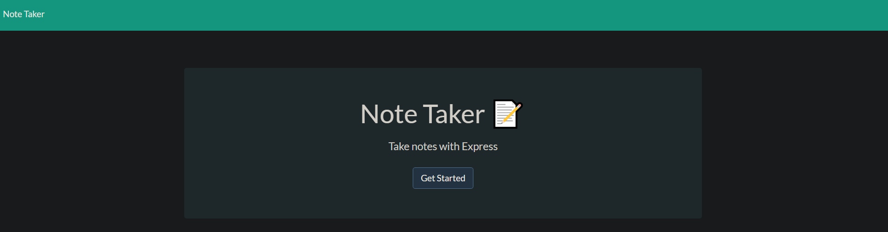
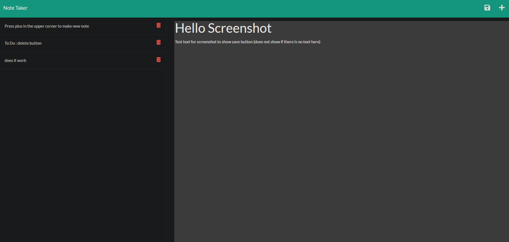

# Note-Taker

## Purpose
A simple note-taking application that a user can input useful notes and reminders into. It uses an HTML front end and Express.js for the backend. This application currently only saves/gets notes, future development will include Deleting and Updating notes

## Built With
* HTML
* Javascript
* CSS
* OpenWeatherAPI

## Deployed Application 
https://radiant-waters-97722.herokuapp.com/

## Screenshot

